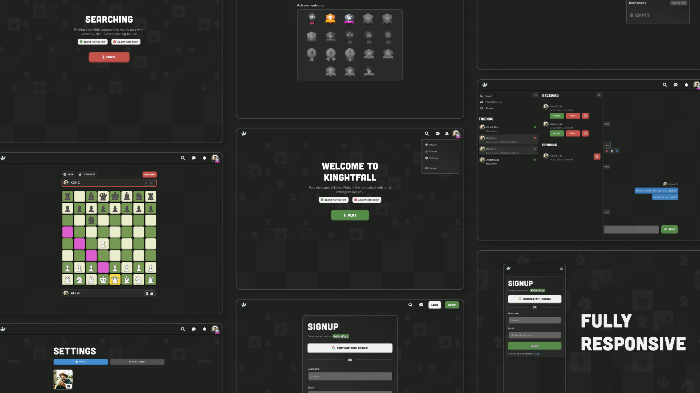

# Knightfall

Play online chess with other player and make friends.



## Features

- Play chess with others in real time (socket rooms)
- Lobby for finding player with similar ranks
- Send friend request, block/accept them
- Chat with friends in real time (use server state and corn job for quick response)
- Real time notification system
- OAuth w/ Google, magic email login, access/refresh token system
- Search for players (pagination)
- Fully responsive
- Design system ([Figma](https://www.figma.com/design/gewbNoq9KMZR29D9i2rvyO/knightfall?node-id=0-1&t=E0ByfUEqBOG6tux5-1))

## Getting Started

Environment variables:

Create `backend/.env` file and then add content of `backend/.env.example` in it along with missing env variables. Do the same with `frontend/.env` and `frontend/.env.example`.

```bash
cp ./backend/.env.example ./backend/.env
cp ./frontend/.env.example ./frontend/.env
```

Starting backend:

```bash
cd backend/
pnpm install
pnpm run dev
```

Starting frontend:

```bash
cd frontend/
pnpm install
pnpm run dev
```

## Technologies

Frontend:

- TypeScript, React, React Router
- React Query, React Hook Form, Redux Toolkit, Zod
- ChakraUI, Framer Motions
- SocketIO
- Storybook, Jest, React Testing Lib

Backend:

- Express, SocketIO, Zod
- PassportJS, JWT
- MongoDB, Mongoose, Typegoose
- Swagger, Cloudinary
- Jest

## Next Steps

- Since each move played board state is saved, game play can be added along with player's past games
- Just like chat between friends, global chat could be a place where any user can come in and chat
- Invite friend for a game
- Add test cases and storybook
- Play with "computer"  

## License

[MIT License](./LICENSE)
